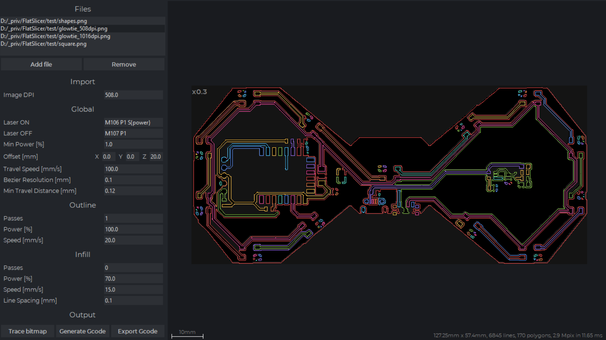

## Description  
FlatSlicer is a tool that generates Gcode from raster images (png, jpeg, etc.) for lasers. It will extract and trace polygons from image and then generate outline/infill in an optimized way.  
  
Useful for making PCBs, engraving text, shapes, cool patterns.  
Not suitable for engraving images (does not support grayscale - yet).  
  
  
  
## Usage  
Eventually I want to provide installer with binaries that will be available to download at the Releases page.  
For now you can run it directly from the source:  
 - Make sure that [python](https://www.python.org/downloads/) is installed
 - Download source code from [here](https://github.com/pbaja/FlatSlicer/archive/refs/heads/main.zip)
 - Unzip it
 - **Windows:** Right click on `run.ps1` and select `Run with PowerShell`
 - **Linux:** Execute `run.sh` from the terminal
 - On the first run the script will automatically create venv and install all dependencies
  
## Documentation  
The project is at a very early stage, the GUI and functionality is constantly changing. Documentation will appear on the Wiki page after the project will be more or less in beta not in alpha state.  
  
## Roadmap  
Features to add before the project would be considered "stable beta".  
 - [ ] Improve workspace performance by switching to external rendering lib (Cairo?)
 - [ ] Importing vector images (svg, dxf?) by converting them to raster images on the fly (CairoSVG?)
 - [ ] Add min-width option to better support thin lines
 - [ ] Add tests
 - [ ] Build binaries with pyinstaller
 - [ ] Add padding option to infill
 - [ ] Add line angle option to infill
 - [ ] Add border option (inset, outset) to outline
 - [ ] Add value checks to prevent accidential breaks
 - [ ] Add raster feature to support engraving raster (grayscale) images
 - [ ] Machine tab, with settings saved separately from project config
 - [ ] In app uploading Gcode to OctoPrint
